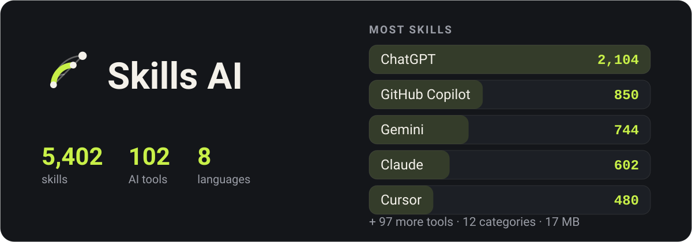

<p align="center">
  
</p>

<div align="center">

A directory of AI tools and the skills that make them better at your work — offline, in eight languages.

</div>

<div align="center">

**English** · [فارسی](docs/README.fa.md) · [العربية](docs/README.ar.md) · [Türkçe](docs/README.tr.md) · [हिन्दी](docs/README.hi.md) · [Español](docs/README.es.md) · [Deutsch](docs/README.de.md) · [Français](docs/README.fr.md)

</div>

## What it looks like

<p align="center">
  
  
  
  
</p>

## Download

| File | For |
|---|---|
| [`app-arm64-v8a-release.apk`](https://github.com/ehsanking/Skills-Ai/releases/latest) | Most phones — anything made in roughly the last eight years. **Start here.** |
| [`app-armeabi-v7a-release.apk`](https://github.com/ehsanking/Skills-Ai/releases/latest) | Older or entry-level phones, 32-bit. |
| [`app-x86_64-release.apk`](https://github.com/ehsanking/Skills-Ai/releases/latest) | Emulators, and the handful of x86 tablets. |

Pick the wrong one and Android refuses to install it rather than installing something broken — so trying `arm64-v8a` first costs nothing.

### Checking what you downloaded

Every APK here is signed with the same key, and you can check that before you install anything:

```
apksigner verify --print-certs app-arm64-v8a-release.apk
```

The certificate should read `CN=Ehsan King, OU=Skills AI` with this SHA-256 fingerprint. A build that does not show it did not come from here.

```
DF:9A:3E:BD:B2:28:06:F4:0F:99:3F:64:0D:46:A2:D2:5A:EA:12:49:53:0F:FF:39:C6:75:C4:BB:4F:66:E1:B4
```

## What it is

Every AI tool answers better when you tell it how. A prompt that makes Claude stop apologising, a rule that keeps Cursor inside your conventions, a system message that gets Gemini to write Persian a native reader would actually write — those exist, scattered across hundreds of repositories, and finding the right one when you need it is the whole problem.

Skills AI collects **5,402 of them for 102 tools**, sorts them into 12 categories, and puts them one search away. The entire catalogue is inside the app: it opens on a train, in a tunnel, on a plane, with no signal and no account.

## What it does

- **Works with no connection** — The whole catalogue — 5,402 skills, their full text, and the search index — ships inside the app as a 17 MB SQLite database. Nothing is fetched to read it.
- **Search that understands the language you type in** — Full-text search across every title and body, with Persian and Arabic folded together: a query typed with Arabic yeh finds text written with Persian yeh, and three sets of digits count as one.
- **Copy, do not retype** — Every skill carries its exact text, an install procedure for the tool it belongs to, and a copy button on each part.
- **Did it actually work?** — One tap after you use a skill says whether it worked, partly worked, or did not — for the model you used. Skills are ranked by that, counted per person, so answering more often moves nothing.
- **A community, without a scoreboard** — Publish your own skills, follow the people whose work keeps helping you, and see on a skill itself which of them tried it. There is no public follower ranking and no endpoint that lists the graph.
- **Eight languages, four of them right-to-left** — English, Persian, Arabic, Turkish, Hindi, Spanish, German and French — the interface, the numerals, the dates and the direction of the layout.

## How it stays offline

<p align="center">
  
</p>

- **In the download** — `skills.db`, 17 MB of SQLite: 5402 skills with their bodies deflated, a full-text index over all of them, and 33 third-party licence texts in full.
- **First launch** — Copied out of the package once and opened read-only. Search, read, copy — no network, no account, no sign-up.
- **When the catalogue grows** — The server publishes a new corpus. The app downloads it, checks its sha256, and stages it beside the live file — never over it — then swaps it in at the next launch.

## How it is built

| | |
|---|---|
| **Android** | 8.0 and newer |
| **Flutter** | 3.44 / Dart 3.12 |
| **Catalogue** | SQLite + FTS4, bodies deflated, 17 MB inside the APK |
| **Backend** | Laravel 13 + Filament 5, [ai.ehsanking.ir](https://ai.ehsanking.ir) |
| **Package** | `gfly.skillsai.app` |
| **Tools / skills** | 102 / 5,402 |

## Privacy

The catalogue works with no account and no network. No advertising identifier, no device identifier, no analytics SDK. An account is needed only for the community — to post, to publish a skill of your own, or to say whether one worked — and even then the app collects nothing about you that you did not type. The full text is in the app under Settings, and on the [website](https://ai.ehsanking.ir/pp).

## Support

Everything in the app is free — every skill, the community, the search and the offline copy — with no paid tier, no subscription and nothing held back behind an account. What keeps it running is advertising and donations, and both go to the same place: servers, storage, bandwidth and the work of making it better.

**Advertise** — the app has two sponsored slots. Details on the [Advertising & Support page](https://ai.ehsanking.ir/advertise).

**Donate** — USDT on the TRON network (TRC-20):

```
TKPswLQqd2e73UTGJ5prxVXBVo7MTsWedU
```

> USDT · TRC-20 (TRON). Sending any other coin or using any other network will lose it.

## Licence

The application is proprietary — see [LICENSE](LICENSE). You may install and use the builds published here freely; you may not republish or resell them.

The **catalogue is not**. Every skill in it belongs to whoever wrote it and is redistributed under the licence they chose — CC0-1.0, MIT, Apache-2.0 or CC-BY-4.0. All 33 sources are named in [THIRD-PARTY-NOTICES.md](THIRD-PARTY-NOTICES.md), and the same notices ship inside the app. A skill offered under no licence at all was not included, because no licence means no permission.

## Author

**Ehsan King** — [github.com/ehsanking](https://github.com/ehsanking)
