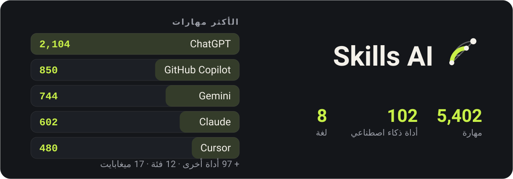

<p align="center">
  
</p>

<div align="center">

دليل لأدوات الذكاء الاصطناعي والمهارات التي تجعلها أفضل في عملك — بلا إنترنت، بثماني لغات.

</div>

<div align="center">

[English](../README.md) · [فارسی](README.fa.md) · **العربية** · [Türkçe](README.tr.md) · [हिन्दी](README.hi.md) · [Español](README.es.md) · [Deutsch](README.de.md) · [Français](README.fr.md)

</div>

<div dir="rtl">

## كيف يبدو

<p align="center">
  
  
  
  
</p>

## التنزيل

### أندرويد

| الملف | لِـ |
|---|---|
| [`app-arm64-v8a-release.apk`](https://github.com/ehsanking/Skills-Ai/releases/latest/download/app-arm64-v8a-release.apk) | معظم الهواتف — أي جهاز صُنع تقريبا في السنوات الثماني الأخيرة. **ابدأ من هنا.** |
| [`app-armeabi-v7a-release.apk`](https://github.com/ehsanking/Skills-Ai/releases/latest/download/app-armeabi-v7a-release.apk) | الهواتف الأقدم أو الاقتصادية، ٣٢ بت. |
| [`app-x86_64-release.apk`](https://github.com/ehsanking/Skills-Ai/releases/latest/download/app-x86_64-release.apk) | المحاكيات وقلة من أجهزة x86 اللوحية. |

إن اخترت الملف الخطأ يرفض أندرويد تثبيته بدل أن يثبت شيئا معطوبا — لذا تجربة `arm64-v8a` أولا لا تكلف شيئا.

**التحقق مما نزّلته**

كل ملف APK هنا موقَّع بالمفتاح نفسه، ويمكنك التحقق من ذلك قبل تثبيت أي شيء:

```
apksigner verify --print-certs app-arm64-v8a-release.apk
```

يجب أن تقرأ الشهادة `CN=Ehsan King, OU=Skills AI` ببصمة SHA-256 هذه. أي نسخة لا تُظهرها لم تأتِ من هنا.

```
DF:9A:3E:BD:B2:28:06:F4:0F:99:3F:64:0D:46:A2:D2:5A:EA:12:49:53:0F:FF:39:C6:75:C4:BB:4F:66:E1:B4
```

### ويندوز

| الملف | لِـ |
|---|---|
| [`SkillsAI-1.0.0-windows-x64-setup.exe`](https://github.com/ehsanking/Skills-Ai/releases/latest/download/SkillsAI-1.0.0-windows-x64-setup.exe) — 23 MB | **المثبِّت.** يُثبَّت داخل مجلد المستخدم الخاص بك — بلا طلب صلاحيات مدير، وبلا كتابة أي شيء خارج حسابك. يضيف اختصارا في قائمة ابدأ وأداة إزالة حقيقية. |
| [`SkillsAI-1.0.0-windows-x64.zip`](https://github.com/ehsanking/Skills-Ai/releases/latest/download/SkillsAI-1.0.0-windows-x64.zip) — 26 MB | **أرشيف محمول.** نسخة محمولة. فك الضغط في أي مكان وشغّل `SkillsAI.exe` — لا شيء يُثبَّت، ولا شيء يُكتب في السجل، ويُفك الفهرس داخل `%APPDATA%\Skills AI` عند أول تشغيل. ويندوز ١٠ (إصدار 1809) فما فوق، ٦٤ بت. لإزالته، احذف المجلد. |

<p align="center">
  
</p>

سيقول ويندوز إنه لا يعرف الناشر. هذا التحذير متوقع: النسخة ليست موقَّعة بشهادة توقيع مدفوعة. وبدل أن أطلب منك تجاوزه ثقة بي، هذه بصمة SHA-256 للملفين — قارن ما نزّلته منهما.

```
ab39330edf1630786a2c017af9fccf0ed5df8544cf505d90cd7f4f27d3b6a9e6  SkillsAI-1.0.0-windows-x64-setup.exe
d7a72df9b944f16d040d2652ac5c9c4c673a4189b064b22bded2fddae1c3740a  SkillsAI-1.0.0-windows-x64.zip
```

```
certutil -hashfile SkillsAI-1.0.0-windows-x64-setup.exe SHA256
```

## ما هذا

كل أداة ذكاء اصطناعي تجيب بشكل أفضل حين تخبرها كيف. موجه يجعل Claude يتوقف عن الاعتذار، قاعدة تبقي Cursor داخل أعرافك البرمجية، رسالة نظام تجعل Gemini يكتب نصا يكتبه متحدث أصلي فعلا — هذه موجودة، مبعثرة عبر مئات المستودعات، والعثور على الصحيح منها وقت الحاجة هو المشكلة كلها.

يجمع Skills AI **5,402 منها لـ 102 أداة**، ويرتبها في 12 فئة، ويضعها على بعد بحث واحد. الدليل كله داخل التطبيق: يفتح في القطار، في نفق، في طائرة، بلا إشارة وبلا حساب.

## ماذا يفعل

- **يعمل بلا اتصال** — الدليل كله — 5,402 مهارة ونصوصها الكاملة وفهرس البحث — يأتي داخل التطبيق كقاعدة بيانات SQLite بحجم 17 ميغابايت. لا شيء ينزل لقراءتها.
- **بحث يفهم اللغة التي تكتب بها** — بحث في النص الكامل عبر كل عنوان وكل متن، مع طي الفارسية والعربية معا: استعلام مكتوب بالياء العربية يجد نصا مكتوبا بالياء الفارسية، ومجموعات الأرقام الثلاث تحسب واحدة.
- **انسخ ولا تعد الكتابة** — كل مهارة تحمل نصها الدقيق، وطريقة تثبيتها في الأداة التي تخصها، وزر نسخ لكل جزء.
- **هل نجحت فعلا؟** — نقرة واحدة بعد استخدام المهارة تقول إن كانت نجحت أو نجحت جزئيا أو لم تنجح — للنموذج الذي استخدمته. ترتيب المهارات مبني على ذلك، محسوبا لكل شخص، فالإجابة الأكثر تكرارا لا تحرك شيئا.
- **مجتمع بلا لوحة نقاط** — انشر مهاراتك، وتابع من يفيدك عملهم باستمرار، وشاهد على المهارة نفسها من منهم جربها. لا ترتيب علني للمتابعين ولا نقطة نهاية تسرد الشبكة.
- **ثماني لغات، أربع منها من اليمين إلى اليسار** — الإنجليزية والفارسية والعربية والتركية والهندية والإسبانية والألمانية والفرنسية — الواجهة والأرقام والتواريخ واتجاه التخطيط.

## كيف يبقى بلا إنترنت

<p align="center">
  
</p>

- **داخل الملف المنزَّل** — `skills.db`، ‏17 ميغابايت من SQLite: ‏5,402 مهارة بنصوص مضغوطة، وفهرس بحث كامل النص عليها جميعا، و33 نص ترخيص لطرف ثالث بالكامل.
- **أول تشغيل** — يُنسخ من الحزمة مرة واحدة ويُفتح للقراءة فقط. ابحث، اقرأ، انسخ — بلا شبكة، بلا حساب، بلا تسجيل.
- **حين يكبر الفهرس** — ينشر الخادم نسخة جديدة. يُنزّلها التطبيق، ويتحقق من sha256، ويضعها بجانب الملف الحي — لا فوقه — ثم يستبدله بها عند التشغيل التالي.

## كيف بني

| | |
|---|---|
| **Android** | 8.0 and newer |
| **Flutter** | 3.44 / Dart 3.12 |
| **Catalogue** | SQLite + FTS4, bodies deflated, 17 MB inside the APK |
| **Backend** | Laravel 13 + Filament 5, [ai.ehsanking.ir](https://ai.ehsanking.ir) |
| **Package** | `gfly.skillsai.app` |
| **Tools / skills** | 102 / 5,402 |

## الخصوصية

يعمل الدليل بلا حساب وبلا شبكة. لا معرف إعلاني، لا معرف جهاز، لا حزمة تحليلات. الحساب مطلوب فقط للمجتمع — للنشر، أو نشر مهارة خاصة بك، أو قول ما إذا نجحت — وحتى حينها لا يجمع التطبيق عنك شيئا لم تكتبه بنفسك. النص الكامل داخل التطبيق في الإعدادات وعلى [الموقع](https://ai.ehsanking.ir/pp).

## الدعم

كل شيء في التطبيق مجاني — كل مهارة، والمجتمع، والبحث، والنسخة دون إنترنت — بلا خطة مدفوعة، بلا اشتراك، وبلا شيء محجوز خلف حساب. ما يبقيه يعمل هو الإعلانات والتبرعات، وكلاهما يذهب إلى المكان نفسه: الخوادم والتخزين والنطاق الترددي والعمل على تحسينه.

**أعلن معنا** — في التطبيق مساحتان إعلانيتان. التفاصيل في [صفحة الإعلانات والدعم](https://ai.ehsanking.ir/advertise).

**تبرع** — USDT على شبكة TRON‏ (TRC-20):

```
TKPswLQqd2e73UTGJ5prxVXBVo7MTsWedU
```

> USDT · TRC-20 (TRON). Sending any other coin or using any other network will lose it.

## الترخيص

التطبيق مملوك — انظر [LICENSE](../LICENSE). يمكنك تثبيت واستخدام الإصدارات المنشورة هنا بحرية؛ ولا يجوز إعادة نشرها أو بيعها.

**الدليل ليس كذلك.** كل مهارة فيه تعود لكاتبها وتعاد بالترخيص الذي اختاره — CC0-1.0 أو MIT أو Apache-2.0 أو CC-BY-4.0. كل المصادر الـ33 مذكورة في [THIRD-PARTY-NOTICES.md](../THIRD-PARTY-NOTICES.md)، والإشعارات نفسها ترافق التطبيق. أما المهارة بلا ترخيص فلم تدرج، لأن غياب الترخيص يعني غياب الإذن.

## المؤلف

**Ehsan King** — [github.com/ehsanking](https://github.com/ehsanking)

</div>
