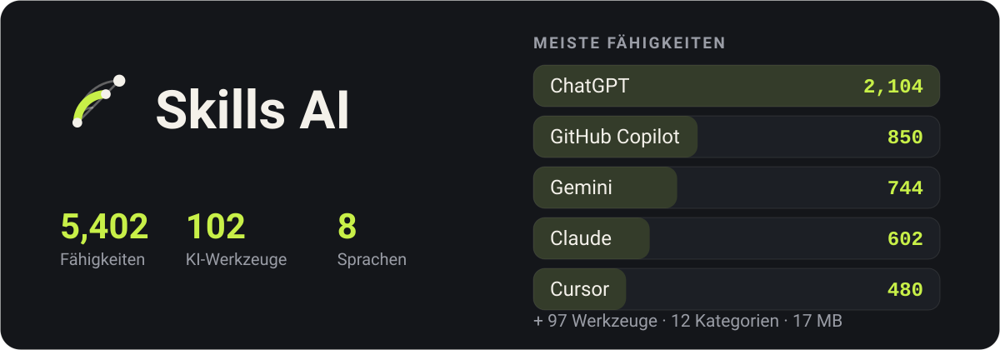

<p align="center">
  
</p>

<div align="center">

Ein Verzeichnis von KI-Werkzeugen und den Fähigkeiten, die sie in deiner Arbeit besser machen — offline, in acht Sprachen.

</div>

<div align="center">

[English](../README.md) · [فارسی](README.fa.md) · [العربية](README.ar.md) · [Türkçe](README.tr.md) · [हिन्दी](README.hi.md) · [Español](README.es.md) · **Deutsch** · [Français](README.fr.md)

</div>

## Wie es aussieht

<p align="center">
  
  
  
  
</p>

## Herunterladen

### Android

| Datei | Für |
|---|---|
| [`app-arm64-v8a-release.apk`](https://github.com/ehsanking/Skills-Ai/releases/latest/download/app-arm64-v8a-release.apk) | Die meisten Telefone — alles aus etwa den letzten acht Jahren. **Hier anfangen.** |
| [`app-armeabi-v7a-release.apk`](https://github.com/ehsanking/Skills-Ai/releases/latest/download/app-armeabi-v7a-release.apk) | Ältere oder einfache Telefone, 32 Bit. |
| [`app-x86_64-release.apk`](https://github.com/ehsanking/Skills-Ai/releases/latest/download/app-x86_64-release.apk) | Emulatoren und die wenigen x86-Tablets. |

Bei der falschen Datei verweigert Android die Installation, statt etwas Kaputtes zu installieren — `arm64-v8a` zuerst zu probieren kostet also nichts.

**Prüfen, was Sie geladen haben**

Jede APK hier ist mit demselben Schlüssel signiert, und Sie können das prüfen, bevor Sie etwas installieren:

```
apksigner verify --print-certs app-arm64-v8a-release.apk
```

Das Zertifikat sollte `CN=Ehsan King, OU=Skills AI` mit diesem SHA-256-Fingerprint zeigen. Ein Build, der ihn nicht zeigt, kommt nicht von hier.

```
DF:9A:3E:BD:B2:28:06:F4:0F:99:3F:64:0D:46:A2:D2:5A:EA:12:49:53:0F:FF:39:C6:75:C4:BB:4F:66:E1:B4
```

### Windows

| Datei | Für |
|---|---|
| [`SkillsAI-1.0.0-windows-x64-setup.exe`](https://github.com/ehsanking/Skills-Ai/releases/latest/download/SkillsAI-1.0.0-windows-x64-setup.exe) — 23 MB | **Installer.** Installiert in Ihren eigenen Benutzerordner — ohne Administratorabfrage und ohne etwas außerhalb Ihres Kontos zu schreiben. Legt einen Startmenü-Eintrag und einen richtigen Uninstaller an. |
| [`SkillsAI-1.0.0-windows-x64.zip`](https://github.com/ehsanking/Skills-Ai/releases/latest/download/SkillsAI-1.0.0-windows-x64.zip) — 26 MB | **Portables ZIP.** Ein portabler Build. Irgendwo entpacken und `SkillsAI.exe` starten — es wird nichts installiert, nichts in die Registry geschrieben, und der Katalog wird beim ersten Start nach `%APPDATA%\Skills AI` entpackt. Windows 10 (1809) und neuer, 64 Bit. Zum Entfernen den Ordner löschen. |

<p align="center">
  
</p>

Windows wird sagen, es kenne den Herausgeber nicht. Diese Warnung ist zu erwarten: der Build ist nicht mit einem kostenpflichtigen Signaturzertifikat signiert. Statt Sie zu bitten, sie auf Vertrauen hin wegzuklicken, hier der SHA-256 beider Dateien — prüfen Sie die, die Sie geladen haben.

```
ab39330edf1630786a2c017af9fccf0ed5df8544cf505d90cd7f4f27d3b6a9e6  SkillsAI-1.0.0-windows-x64-setup.exe
d7a72df9b944f16d040d2652ac5c9c4c673a4189b064b22bded2fddae1c3740a  SkillsAI-1.0.0-windows-x64.zip
```

```
certutil -hashfile SkillsAI-1.0.0-windows-x64-setup.exe SHA256
```

## Was es ist

Jedes KI-Werkzeug antwortet besser, wenn man ihm sagt wie. Ein Prompt, der Claude das ständige Entschuldigen abgewöhnt, eine Regel, die Cursor innerhalb deiner Konventionen hält, eine Systemnachricht, die Gemini dazu bringt, so zu schreiben wie eine Muttersprachlerin es täte — das gibt es, verstreut über Hunderte Repositories, und das richtige im richtigen Moment zu finden ist das ganze Problem.

Skills AI sammelt **5,402 davon für 102 Werkzeuge**, sortiert sie in 12 Kategorien und legt sie eine Suche weit weg. Der gesamte Katalog steckt in der App: Sie öffnet im Zug, im Tunnel, im Flugzeug — ohne Empfang und ohne Konto.

## Was es kann

- **Funktioniert ohne Verbindung** — Der ganze Katalog — 5,402 Fähigkeiten, ihr vollständiger Text und der Suchindex — steckt als 17 MB große SQLite-Datenbank in der App. Zum Lesen wird nichts geladen.
- **Eine Suche, die versteht, in welcher Sprache du tippst** — Volltextsuche über jeden Titel und jeden Text, wobei Persisch und Arabisch zusammengefaltet werden: eine mit arabischem Ye getippte Anfrage findet Text mit persischem Ye, und drei Ziffernsätze zählen als einer.
- **Kopieren statt abtippen** — Jede Fähigkeit bringt ihren exakten Text mit, die Installationsanleitung für das Werkzeug, zu dem sie gehört, und einen Kopierknopf an jedem Teil.
- **Hat es wirklich funktioniert?** — Ein Tippen nach der Nutzung sagt, ob es funktioniert hat, teilweise oder gar nicht — für das Modell, das du benutzt hast. Danach werden Fähigkeiten sortiert, pro Person gezählt, sodass häufigeres Antworten nichts verschiebt.
- **Eine Community ohne Punktetafel** — Veröffentliche eigene Fähigkeiten, folge den Leuten, deren Arbeit dir immer wieder hilft, und sieh an der Fähigkeit selbst, wer von ihnen sie ausprobiert hat. Es gibt keine öffentliche Follower-Rangliste und keinen Endpunkt, der den Graphen auflistet.
- **Acht Sprachen, vier davon von rechts nach links** — Englisch, Persisch, Arabisch, Türkisch, Hindi, Spanisch, Deutsch und Französisch — die Oberfläche, die Ziffern, die Datumsangaben und die Leserichtung.

## Wie es offline bleibt

<p align="center">
  
</p>

- **Im Download** — `skills.db`, 17 MB SQLite: 5,402 Fähigkeiten mit komprimierten Texten, ein Volltextindex über alle und 33 vollständige Lizenztexte Dritter.
- **Erster Start** — Einmal aus dem Paket kopiert und schreibgeschützt geöffnet. Suchen, lesen, kopieren — kein Netz, kein Konto, keine Anmeldung.
- **Wenn der Katalog wächst** — Der Server veröffentlicht ein neues Korpus. Die App lädt es, prüft seinen sha256 und legt es neben die aktive Datei — nie darüber — und tauscht sie beim nächsten Start aus.

## Wie es gebaut ist

| | |
|---|---|
| **Android** | 8.0 and newer |
| **Flutter** | 3.44 / Dart 3.12 |
| **Catalogue** | SQLite + FTS4, bodies deflated, 17 MB inside the APK |
| **Backend** | Laravel 13 + Filament 5, [ai.ehsanking.ir](https://ai.ehsanking.ir) |
| **Package** | `gfly.skillsai.app` |
| **Tools / skills** | 102 / 5,402 |

## Datenschutz

Der Katalog funktioniert ohne Konto und ohne Netz. Keine Werbe-ID, keine Geräte-ID, kein Analytics-SDK. Ein Konto braucht nur die Community — zum Posten, zum Veröffentlichen einer eigenen Fähigkeit oder um zu sagen, ob eine funktioniert hat — und selbst dann sammelt die App nichts über dich, was du nicht selbst geschrieben hast. Der volle Text steht in der App unter Einstellungen und auf der [Website](https://ai.ehsanking.ir/pp).

## Unterstützen

Alles in der App ist kostenlos — jede Fähigkeit, die Community, die Suche und die Offline-Kopie — ohne Bezahlstufe, ohne Abo und ohne irgendetwas, das hinter einem Konto zurückgehalten wird. Am Laufen halten sie Werbung und Spenden, und beide gehen an dieselbe Stelle: Server, Speicher, Bandbreite und die Arbeit daran, sie besser zu machen.

**Werben** — die App hat zwei gesponserte Plätze. Details auf der [Werbe- und Unterstützungsseite](https://ai.ehsanking.ir/advertise).

**Spenden** — USDT im TRON-Netzwerk (TRC-20):

```
TKPswLQqd2e73UTGJ5prxVXBVo7MTsWedU
```

> USDT · TRC-20 (TRON). Sending any other coin or using any other network will lose it.

## Lizenz

Die Anwendung ist proprietär — siehe [LICENSE](../LICENSE). Du darfst die hier veröffentlichten Builds frei installieren und nutzen; weiterveröffentlichen oder verkaufen darfst du sie nicht.

**Der Katalog nicht.** Jede Fähigkeit gehört der Person, die sie geschrieben hat, und wird unter der von ihr gewählten Lizenz weitergegeben — CC0-1.0, MIT, Apache-2.0 oder CC-BY-4.0. Alle 33 Quellen sind in [THIRD-PARTY-NOTICES.md](../THIRD-PARTY-NOTICES.md) genannt, und dieselben Hinweise liegen der App bei. Eine Fähigkeit ganz ohne Lizenz wurde nicht aufgenommen, denn keine Lizenz heißt keine Erlaubnis.

## Autor

**Ehsan King** — [github.com/ehsanking](https://github.com/ehsanking)
