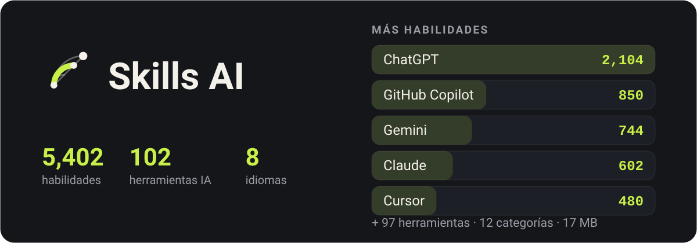

<p align="center">
  
</p>

<div align="center">

Un directorio de herramientas de IA y las habilidades que las hacen mejores en tu trabajo — sin conexión, en ocho idiomas.

</div>

<div align="center">

[English](../README.md) · [فارسی](README.fa.md) · [العربية](README.ar.md) · [Türkçe](README.tr.md) · [हिन्दी](README.hi.md) · **Español** · [Deutsch](README.de.md) · [Français](README.fr.md)

</div>

## Qué aspecto tiene

<p align="center">
  
  
  
  
</p>

## Descargar

### Android

| Archivo | Para |
|---|---|
| [`SkillsAI.apk`](https://github.com/ehsanking/Skills-Ai/releases/latest/download/SkillsAI.apk) — 64 MB | Cualquier teléfono Android: arm64, ARM de 32 bits y x86 en un solo archivo. Android 8.0 o posterior. |

Un solo archivo para cualquier teléfono, así que no hay nada que elegir.

**Comprobar lo que descargaste**

Cada APK aquí está firmado con la misma clave, y puedes comprobarlo antes de instalar nada:

```
apksigner verify --print-certs SkillsAI.apk
```

El certificado debe decir `CN=Ehsan King, OU=Skills AI` con esta huella SHA-256. Una compilación que no la muestre no vino de aquí.

```
DF:9A:3E:BD:B2:28:06:F4:0F:99:3F:64:0D:46:A2:D2:5A:EA:12:49:53:0F:FF:39:C6:75:C4:BB:4F:66:E1:B4
```

```
31741a970b79658b1288378f6214072c986b06331e6d9bb07332bba459aa56a4  SkillsAI.apk
```

### Windows

| Archivo | Para |
|---|---|
| [`SkillsAI-windows-x64-setup.exe`](https://github.com/ehsanking/Skills-Ai/releases/latest/download/SkillsAI-windows-x64-setup.exe) — 23 MB | **Instalador.** Se instala en tu propia carpeta de usuario: sin petición de administrador y sin escribir nada fuera de tu cuenta. Añade una entrada en el menú Inicio y un desinstalador de verdad. |
| [`SkillsAI-windows-x64.zip`](https://github.com/ehsanking/Skills-Ai/releases/latest/download/SkillsAI-windows-x64.zip) — 26 MB | **Zip portátil.** Una compilación portátil. Descomprímela donde quieras y ejecuta `SkillsAI.exe`: no se instala nada, no se escribe nada en el registro y el catálogo se descomprime en `%APPDATA%\Skills AI` la primera vez que se abre. Windows 10 (1809) o posterior, 64 bits. Para quitarlo, borra la carpeta. |

<p align="center">
  
</p>

Windows dirá que no reconoce al editor. Esa advertencia es esperable: la compilación no está firmada con un certificado de firma de código de pago. En lugar de pedirte que la saltes por confianza, aquí está el SHA-256 de ambos archivos: comprueba el que descargaste.

```
f5bf42a59cb6b2d571fc0c5b3e965eca40399e00a458f38d523378202a336a74  SkillsAI-windows-x64-setup.exe
c153b1172534189166a5e577804d459e79ee282d2b79d7844196e6ccee5e9851  SkillsAI-windows-x64.zip
```

```
certutil -hashfile SkillsAI-windows-x64-setup.exe SHA256
```

### iPhone y iPad

No hay versión en la App Store. Ábrelo en Safari y añádelo a tu pantalla de inicio: se abre a pantalla completa, con su propio icono, y se comporta como una app.

[**ai.ehsanking.ir/app**](https://ai.ehsanking.ir/app)

> Las páginas que has abierto se pueden leer sin conexión. El catálogo entero sin conexión está en las versiones de Android y Windows.

## Qué es

Toda herramienta de IA responde mejor cuando le dices cómo. Un prompt que hace que Claude deje de disculparse, una regla que mantiene a Cursor dentro de tus convenciones, un mensaje de sistema que consigue que Gemini escriba como lo haría un hablante nativo — existen, dispersos por cientos de repositorios, y encontrar el adecuado cuando hace falta es todo el problema.

Skills AI reúne **5,402 de ellos para 102 herramientas**, los ordena en 12 categorías y los deja a una búsqueda de distancia. Todo el catálogo está dentro de la app: se abre en un tren, en un túnel, en un avión, sin señal y sin cuenta.

## Qué hace

- **Funciona sin conexión** — Todo el catálogo — 5,402 habilidades, su texto completo y el índice de búsqueda — viaja dentro de la app como una base SQLite de 17 MB. No se descarga nada para leerlo.
- **Una búsqueda que entiende el idioma en que escribes** — Búsqueda de texto completo en cada título y cada cuerpo, con el persa y el árabe plegados juntos: una consulta escrita con ye árabe encuentra texto escrito con ye persa, y los tres conjuntos de dígitos cuentan como uno.
- **Copia, no vuelvas a escribir** — Cada habilidad lleva su texto exacto, el procedimiento de instalación de la herramienta a la que pertenece y un botón de copiar en cada parte.
- **¿Funcionó de verdad?** — Un toque después de usar una habilidad dice si funcionó, funcionó en parte o no funcionó — para el modelo que usaste. Las habilidades se ordenan por eso, contado por persona, así que responder más veces no mueve nada.
- **Una comunidad, sin marcador** — Publica tus propias habilidades, sigue a quienes te ayudan una y otra vez, y ve en la propia habilidad quién de ellos la probó. No hay ranking público de seguidores ni endpoint que liste el grafo.
- **Ocho idiomas, cuatro de derecha a izquierda** — Inglés, persa, árabe, turco, hindi, español, alemán y francés — la interfaz, los números, las fechas y la dirección del diseño.

## Cómo se mantiene sin conexión

<p align="center">
  
</p>

- **Dentro de la descarga** — `skills.db`, 17 MB de SQLite: 5,402 habilidades con sus textos comprimidos, un índice de texto completo sobre todas ellas y 33 textos de licencia de terceros íntegros.
- **Primer arranque** — Se copia del paquete una vez y se abre en solo lectura. Busca, lee, copia — sin red, sin cuenta, sin registro.
- **Cuando el catálogo crece** — El servidor publica un corpus nuevo. La app lo descarga, comprueba su sha256 y lo deja junto al archivo vivo — nunca encima — y lo sustituye en el siguiente arranque.

## Cómo está hecho

| | |
|---|---|
| **Android** | 8.0 and newer |
| **Flutter** | 3.44 / Dart 3.12 |
| **Catalogue** | SQLite + FTS4, bodies deflated, 17 MB inside the APK |
| **Backend** | Laravel 13 + Filament 5, [ai.ehsanking.ir](https://ai.ehsanking.ir) |
| **Package** | `gfly.skillsai.app` |
| **Tools / skills** | 102 / 5,402 |

## Privacidad

El catálogo funciona sin cuenta y sin red. Sin identificador publicitario, sin identificador de dispositivo, sin SDK de analítica. Solo hace falta una cuenta para la comunidad — publicar, compartir una habilidad propia o decir si funcionó — e incluso entonces la app no recoge nada sobre ti que tú no hayas escrito. El texto completo está en la app, en Ajustes, y en la [web](https://ai.ehsanking.ir/pp).

## Apoyo

Todo en la app es gratis — cada habilidad, la comunidad, la búsqueda y la copia sin conexión — sin nivel de pago, sin suscripción y sin nada retenido tras una cuenta. Lo que la mantiene en marcha son la publicidad y las donaciones, y ambas van al mismo sitio: servidores, almacenamiento, ancho de banda y el trabajo de mejorarla.

**Anúnciate** — la app tiene dos espacios patrocinados. Detalles en la [página de Publicidad y Apoyo](https://ai.ehsanking.ir/advertise).

**Dona** — USDT, en cualquiera de estas dos redes. BEP-20 suele costar menos:

**BEP-20 · BNB Smart Chain**

```
0x53F494E1Fc1Ee777C55B49048dd1ab7e4C5d7244
```

**TRC-20 · TRON**

```
TKPswLQqd2e73UTGJ5prxVXBVo7MTsWedU
```

> Solo USDT, y solo en estas dos redes. Otra moneda, u otra red, no rebota: simplemente se pierde.

## Licencia

La aplicación es propietaria — véase [LICENSE](../LICENSE). Puedes instalar y usar libremente las versiones publicadas aquí; no puedes redistribuirlas ni revenderlas.

**El catálogo no lo es.** Cada habilidad pertenece a quien la escribió y se redistribuye bajo la licencia que eligió — CC0-1.0, MIT, Apache-2.0 o CC-BY-4.0. Las 33 fuentes están nombradas en [THIRD-PARTY-NOTICES.md](../THIRD-PARTY-NOTICES.md), y los mismos avisos viajan dentro de la app. Una habilidad sin ninguna licencia no se incluyó, porque sin licencia no hay permiso.

## Autor

**Ehsan King** — [github.com/ehsanking](https://github.com/ehsanking)
