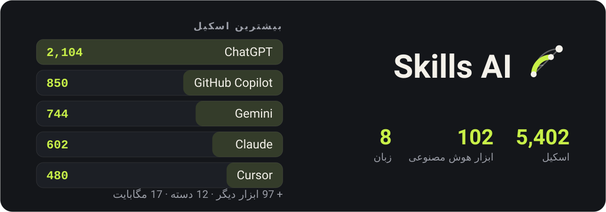
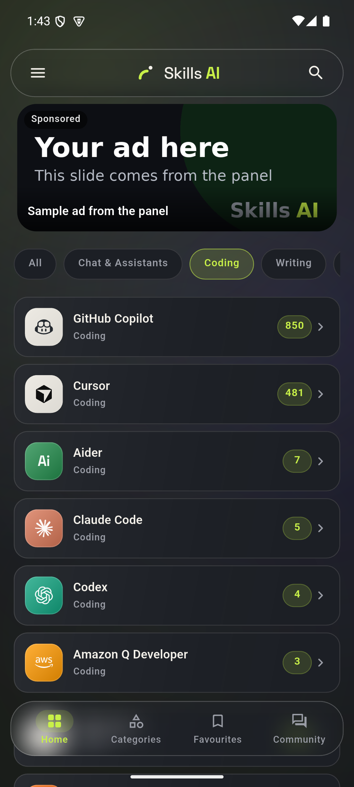
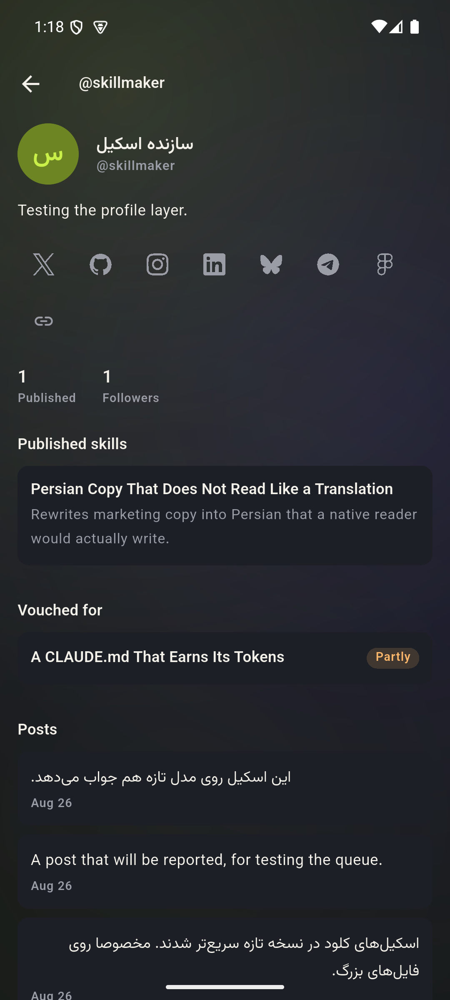
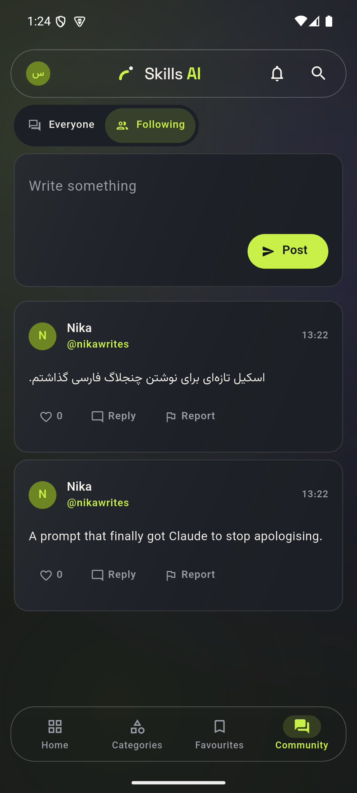
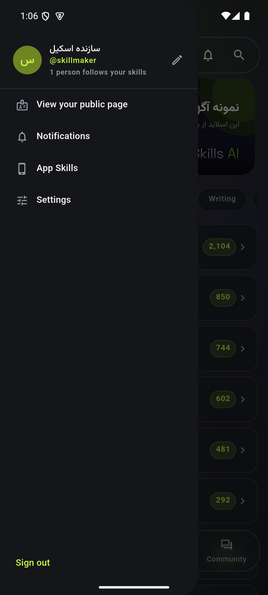
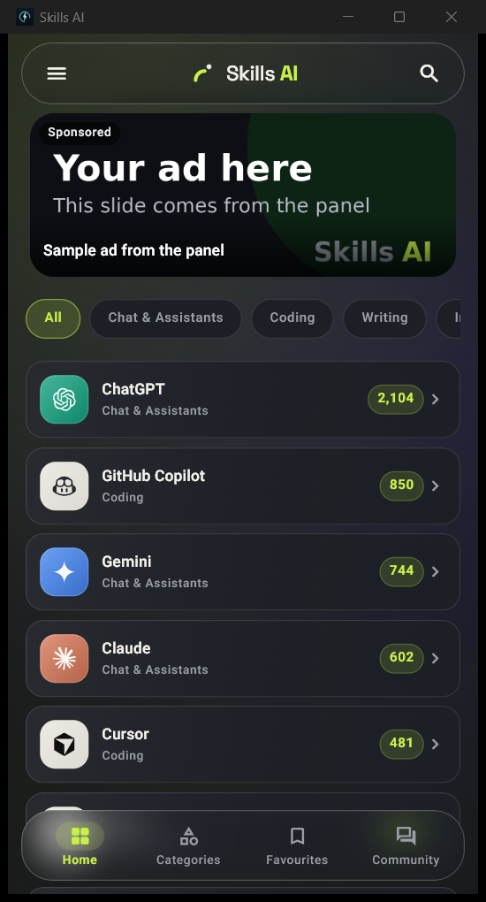
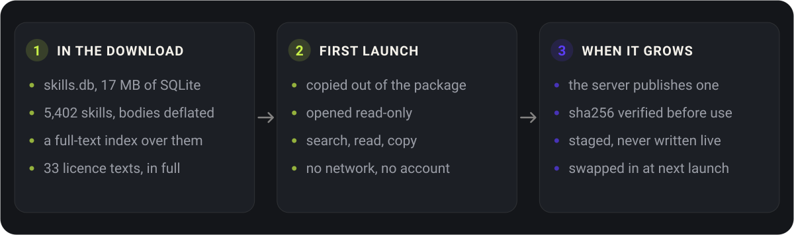

<p align="center">
  
</p>

<div align="center">

فهرستی از ابزارهای هوش مصنوعی و اسکیل‌هایی که آن‌ها را در کار شما بهتر می‌کنند — آفلاین، به هشت زبان.

</div>

<div align="center">

[English](../README.md) · **فارسی** · [العربية](README.ar.md) · [Türkçe](README.tr.md) · [हिन्दी](README.hi.md) · [Español](README.es.md) · [Deutsch](README.de.md) · [Français](README.fr.md)

</div>

<div dir="rtl">

## چه شکلی است

<p align="center">
  
  
  
  
</p>

## دانلود

### اندروید

| فایل | برای |
|---|---|
| [`app-arm64-v8a-release.apk`](https://github.com/ehsanking/Skills-Ai/releases/latest/download/app-arm64-v8a-release.apk) | بیشتر گوشی‌ها — هر چیزی که تقریبا در هشت سال گذشته ساخته شده. **از اینجا شروع کنید.** |
| [`app-armeabi-v7a-release.apk`](https://github.com/ehsanking/Skills-Ai/releases/latest/download/app-armeabi-v7a-release.apk) | گوشی‌های قدیمی‌تر یا ارزان‌تر، ۳۲ بیتی. |
| [`app-x86_64-release.apk`](https://github.com/ehsanking/Skills-Ai/releases/latest/download/app-x86_64-release.apk) | شبیه‌سازها و آن چند تبلت x86. |

اگر اشتباه انتخاب کنید، اندروید به‌جای نصب چیزی خراب، نصبش را رد می‌کند — پس امتحان‌کردن `arm64-v8a` هیچ هزینه‌ای ندارد.

**سنجیدن آنچه دانلود کرده‌اید**

هر APK اینجا با یک کلید امضا شده، و می‌توانید پیش از نصب هر چیزی آن را بسنجید:

```
apksigner verify --print-certs app-arm64-v8a-release.apk
```

گواهی باید `CN=Ehsan King, OU=Skills AI` را نشان بدهد با همین اثرانگشت SHA-256. بیلدی که این را نشان ندهد از اینجا نیامده است.

```
DF:9A:3E:BD:B2:28:06:F4:0F:99:3F:64:0D:46:A2:D2:5A:EA:12:49:53:0F:FF:39:C6:75:C4:BB:4F:66:E1:B4
```

### ویندوز

| فایل | برای |
|---|---|
| [`SkillsAI-1.0.0-windows-x64-setup.exe`](https://github.com/ehsanking/Skills-Ai/releases/latest/download/SkillsAI-1.0.0-windows-x64-setup.exe) — 23 MB | **نصب‌کننده.** داخل پوشه کاربری خودتان نصب می‌شود — بدون درخواست دسترسی مدیر، و بدون نوشتن چیزی بیرون از حساب شما. یک ورودی در منوی استارت و یک حذف‌کننده درست اضافه می‌کند. |
| [`SkillsAI-1.0.0-windows-x64.zip`](https://github.com/ehsanking/Skills-Ai/releases/latest/download/SkillsAI-1.0.0-windows-x64.zip) — 26 MB | **زیپ قابل حمل.** یک بیلد قابل حمل. هر جا خواستید از حالت فشرده در بیاورید و `SkillsAI.exe` را اجرا کنید — هیچ چیزی نصب نمی‌شود، هیچ چیزی در رجیستری نوشته نمی‌شود، و پیکره در اولین اجرا داخل `%APPDATA%\Skills AI` باز می‌شود. ویندوز ۱۰ (نسخه ۱۸۰۹) به بالا، ۶۴ بیتی. برای حذفش، پوشه را پاک کنید. |

<p align="center">
  
</p>

ویندوز می‌گوید ناشر را نمی‌شناسد. این هشدار طبیعی است: این بیلد با گواهی امضای کد پولی امضا نشده. به‌جای اینکه از شما بخواهم روی حرف من از آن رد شوید، این SHA-256 هر دو فایل است — همانی را که دانلود کرده‌اید بسنجید.

```
ab39330edf1630786a2c017af9fccf0ed5df8544cf505d90cd7f4f27d3b6a9e6  SkillsAI-1.0.0-windows-x64-setup.exe
d7a72df9b944f16d040d2652ac5c9c4c673a4189b064b22bded2fddae1c3740a  SkillsAI-1.0.0-windows-x64.zip
```

```
certutil -hashfile SkillsAI-1.0.0-windows-x64-setup.exe SHA256
```

## این چیست

هر ابزار هوش مصنوعی وقتی بگویید چطور، بهتر جواب می‌دهد. پرامپتی که کلود را از عذرخواهی مدام بازمی‌دارد، قاعده‌ای که کرسر را داخل قراردادهای کد شما نگه می‌دارد، پیام سیستمی که جمنای را وادار می‌کند فارسی‌ای بنویسد که یک فارسی‌زبان واقعا می‌نویسد — این‌ها وجود دارند، پراکنده در صدها مخزن، و پیدا کردن درستش در لحظه‌ی نیاز، تمام مسئله است.

اسکیلز ای‌آی **5,402 تای آن‌ها را برای 102 ابزار** جمع کرده، در 12 دسته مرتب کرده و یک جست‌وجو دورترشان کرده است. کل این فهرست داخل خود اپ است: در قطار باز می‌شود، در تونل، در هواپیما، بدون آنتن و بدون حساب کاربری.

## چه می‌کند

- **بدون اینترنت کار می‌کند** — کل فهرست — 5,402 اسکیل، متن کاملشان و نمایه‌ی جست‌وجو — به‌صورت یک پایگاه‌داده‌ی SQLite ‏17 مگابایتی داخل خود اپ است. برای خواندنشان چیزی دانلود نمی‌شود.
- **جست‌وجویی که زبان شما را می‌فهمد** — جست‌وجوی تمام‌متن روی هر عنوان و هر متن، با تاکردن فارسی و عربی: عبارتی که با «ی» عربی تایپ شود متنی را که با «ی» فارسی نوشته شده پیدا می‌کند، و هر سه دسته ارقام یکی حساب می‌شوند.
- **کپی کنید، دوباره تایپ نکنید** — هر اسکیل متن دقیقش، روال نصب مخصوص ابزار خودش، و دکمه‌ی کپی روی هر بخش را دارد.
- **واقعا کار کرد؟** — یک لمس بعد از استفاده می‌گوید کار کرد، تا حدی کار کرد، یا نکرد — برای همان مدلی که استفاده کردید. رتبه‌بندی اسکیل‌ها بر همین پایه است و به‌ازای هر آدم شمرده می‌شود، پس جواب‌دادن بیشتر چیزی را جابه‌جا نمی‌کند.
- **یک انجمن، بدون تابلوی امتیاز** — اسکیل خودتان را منتشر کنید، کسانی را که کارشان مدام به دردتان می‌خورد دنبال کنید، و روی خود اسکیل ببینید کدامشان امتحانش کرده. هیچ رتبه‌بندی عمومی دنبال‌کننده و هیچ اندپوینتی که گراف را فهرست کند وجود ندارد.
- **هشت زبان، چهارتا راست‌به‌چپ** — انگلیسی، فارسی، عربی، ترکی، هندی، اسپانیایی، آلمانی و فرانسوی — رابط، ارقام، تاریخ‌ها و جهت چیدمان.

## چطور آفلاین می‌ماند

<p align="center">
  
</p>

- **در فایل دانلود** — ‏`skills.db`، ‏17 مگابایت SQLite: ‏5,402 اسکیل با متن فشرده‌شده، یک نمایه جست‌وجوی تمام‌متن روی همه‌شان، و 33 متن کامل مجوز شخص ثالث.
- **اولین اجرا** — یک بار از داخل بسته بیرون کشیده و فقط‌خواندنی باز می‌شود. جست‌وجو، خواندن، کپی — بدون شبکه، بدون حساب، بدون ثبت‌نام.
- **وقتی پیکره بزرگ می‌شود** — سرور نسخه تازه‌ای منتشر می‌کند. اپ آن را دانلود می‌کند، sha256 آن را می‌سنجد، و کنار فایل زنده می‌گذاردش — نه رویش — و در اجرای بعدی جایگزینش می‌کند.

## چطور ساخته شده

| | |
|---|---|
| **Android** | 8.0 and newer |
| **Flutter** | 3.44 / Dart 3.12 |
| **Catalogue** | SQLite + FTS4, bodies deflated, 17 MB inside the APK |
| **Backend** | Laravel 13 + Filament 5, [ai.ehsanking.ir](https://ai.ehsanking.ir) |
| **Package** | `gfly.skillsai.app` |
| **Tools / skills** | 102 / 5,402 |

## حریم خصوصی

فهرست بدون حساب کاربری و بدون شبکه کار می‌کند. نه شناسه‌ی تبلیغاتی، نه شناسه‌ی دستگاه، نه SDK تحلیلی. حساب فقط برای بخش انجمن لازم است — برای نوشتن، منتشر کردن اسکیل خودتان، یا گفتن اینکه اسکیلی کار کرد یا نه — و حتی آن‌وقت هم اپ چیزی درباره‌ی شما جمع نمی‌کند که خودتان ننوشته باشید. متن کامل داخل اپ در تنظیمات و در [وب‌سایت](https://ai.ehsanking.ir/pp) هست.

## حمایت

همه‌چیز در اپ رایگان است — هر اسکیل، انجمن، جست‌وجو و نسخه‌ی آفلاین — بدون نسخه‌ی پولی، بدون اشتراک، و بدون چیزی که پشت حساب کاربری نگه داشته شده باشد. آنچه آن را سرپا نگه می‌دارد تبلیغات و کمک مالی است، و هر دو به یک جا می‌روند: سرور، فضای ذخیره‌سازی، پهنای باند، و کار بهتر کردنش.

**تبلیغات** — اپ دو جایگاه تبلیغاتی دارد. جزئیات در [صفحه‌ی تبلیغات و حمایت](https://ai.ehsanking.ir/advertise).

**کمک مالی** — تتر، روی هر کدام از این دو شبکه. کارمزد BEP-20 معمولا کمتر است:

**شبکه بی‌ان‌بی · BEP-20**

```
0x53F494E1Fc1Ee777C55B49048dd1ab7e4C5d7244
```

**شبکه ترون · TRC-20**

```
TKPswLQqd2e73UTGJ5prxVXBVo7MTsWedU
```

> فقط تتر (USDT)، و فقط روی همین دو شبکه. ارز دیگر یا شبکه دیگر برنمی‌گردد — به‌سادگی از بین می‌رود.

## مجوز

خود اپ اختصاصی است — [LICENSE](../LICENSE) را ببینید. می‌توانید نسخه‌های منتشرشده اینجا را آزادانه نصب و استفاده کنید؛ اجازه‌ی بازنشر یا فروش مجددشان را ندارید.

**فهرست اسکیل‌ها این‌طور نیست.** هر اسکیل متعلق به کسی است که نوشته و با همان مجوزی بازنشر می‌شود که خودش انتخاب کرده — CC0-1.0، MIT، Apache-2.0 یا CC-BY-4.0. هر 33 منبع در [THIRD-PARTY-NOTICES.md](../THIRD-PARTY-NOTICES.md) نام برده شده‌اند و همان اسناد داخل خود اپ هم ارسال می‌شوند. اسکیلی که هیچ مجوزی نداشت وارد نشد، چون «بدون مجوز» یعنی «بدون اجازه».

## سازنده

**Ehsan King** — [github.com/ehsanking](https://github.com/ehsanking)

</div>
