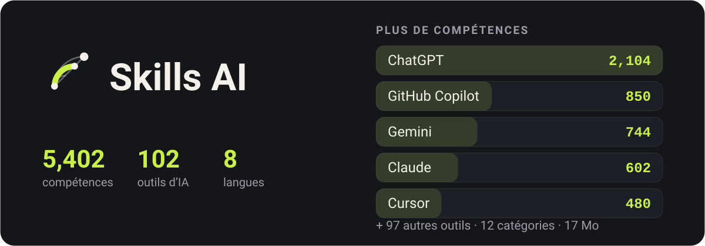

<p align="center">
  
</p>

<div align="center">

Un répertoire d'outils d'IA et des compétences qui les rendent meilleurs dans votre travail — hors ligne, en huit langues.

</div>

<div align="center">

[English](../README.md) · [فارسی](README.fa.md) · [العربية](README.ar.md) · [Türkçe](README.tr.md) · [हिन्दी](README.hi.md) · [Español](README.es.md) · [Deutsch](README.de.md) · **Français**

</div>

## À quoi il ressemble

<p align="center">
  
  
  
  
</p>

## Télécharger

### Android

| Fichier | Pour |
|---|---|
| [`app-arm64-v8a-release.apk`](https://github.com/ehsanking/Skills-Ai/releases/latest/download/app-arm64-v8a-release.apk) | La plupart des téléphones — à peu près tout ce qui date des huit dernières années. **Commencez ici.** |
| [`app-armeabi-v7a-release.apk`](https://github.com/ehsanking/Skills-Ai/releases/latest/download/app-armeabi-v7a-release.apk) | Téléphones anciens ou d’entrée de gamme, 32 bits. |
| [`app-x86_64-release.apk`](https://github.com/ehsanking/Skills-Ai/releases/latest/download/app-x86_64-release.apk) | Émulateurs, et les quelques tablettes x86. |

Si vous prenez le mauvais, Android refuse de l’installer plutôt que d’installer quelque chose de cassé — essayer `arm64-v8a` d’abord ne coûte donc rien.

**Vérifier ce que vous avez téléchargé**

Chaque APK ici est signé avec la même clé, et vous pouvez le vérifier avant d’installer quoi que ce soit :

```
apksigner verify --print-certs app-arm64-v8a-release.apk
```

Le certificat doit indiquer `CN=Ehsan King, OU=Skills AI` avec cette empreinte SHA-256. Une version qui ne l’affiche pas ne vient pas d’ici.

```
DF:9A:3E:BD:B2:28:06:F4:0F:99:3F:64:0D:46:A2:D2:5A:EA:12:49:53:0F:FF:39:C6:75:C4:BB:4F:66:E1:B4
```

### Windows

| Fichier | Pour |
|---|---|
| [`SkillsAI-1.0.0-windows-x64-setup.exe`](https://github.com/ehsanking/Skills-Ai/releases/latest/download/SkillsAI-1.0.0-windows-x64-setup.exe) — 23 MB | **Programme d’installation.** S’installe dans votre propre dossier utilisateur : aucune demande d’administrateur, rien d’écrit en dehors de votre compte. Ajoute une entrée au menu Démarrer et un vrai programme de désinstallation. |
| [`SkillsAI-1.0.0-windows-x64.zip`](https://github.com/ehsanking/Skills-Ai/releases/latest/download/SkillsAI-1.0.0-windows-x64.zip) — 26 MB | **Zip portable.** Une version portable. Décompressez-la où vous voulez et lancez `SkillsAI.exe` : rien n’est installé, rien n’est écrit dans le registre, et le catalogue est extrait dans `%APPDATA%\Skills AI` au premier lancement. Windows 10 (1809) et plus, 64 bits. Pour l’enlever, supprimez le dossier. |

<p align="center">
  
</p>

Windows dira qu’il ne reconnaît pas l’éditeur. Cet avertissement est normal : la version n’est pas signée avec un certificat de signature de code payant. Plutôt que de vous demander de passer outre sur parole, voici le SHA-256 des deux fichiers — vérifiez celui que vous avez téléchargé.

```
ab39330edf1630786a2c017af9fccf0ed5df8544cf505d90cd7f4f27d3b6a9e6  SkillsAI-1.0.0-windows-x64-setup.exe
d7a72df9b944f16d040d2652ac5c9c4c673a4189b064b22bded2fddae1c3740a  SkillsAI-1.0.0-windows-x64.zip
```

```
certutil -hashfile SkillsAI-1.0.0-windows-x64-setup.exe SHA256
```

## Ce que c'est

Tout outil d'IA répond mieux quand on lui dit comment. Un prompt qui empêche Claude de s'excuser sans arrêt, une règle qui maintient Cursor dans vos conventions, un message système qui pousse Gemini à écrire ce qu’un locuteur natif écrirait vraiment — cela existe, éparpillé dans des centaines de dépôts, et trouver le bon au bon moment est tout le problème.

Skills AI en rassemble **5,402 pour 102 outils**, les range en 12 catégories et les met à une recherche de distance. Tout le catalogue est dans l'application : elle s'ouvre dans un train, dans un tunnel, dans un avion, sans réseau et sans compte.

## Ce qu’il fait

- **Fonctionne sans connexion** — Tout le catalogue — 5,402 compétences, leur texte intégral et l'index de recherche — tient dans l'application sous forme d'une base SQLite de 17 Mo. Rien n'est téléchargé pour le lire.
- **Une recherche qui comprend la langue dans laquelle vous tapez** — Recherche plein texte sur chaque titre et chaque corps, le persan et l’arabe étant repliés ensemble : une requête tapée avec le yé arabe trouve un texte écrit avec le yé persan, et les trois jeux de chiffres comptent pour un.
- **Copiez, ne retapez pas** — Chaque compétence porte son texte exact, la procédure d'installation pour l'outil auquel elle appartient, et un bouton de copie sur chaque partie.
- **Est-ce que ça a vraiment marché ?** — Une pression après avoir utilisé une compétence dit si elle a marché, en partie, ou pas — pour le modèle que vous avez utilisé. Les compétences sont classées là-dessus, compté par personne, donc répondre plus souvent ne déplace rien.
- **Une communauté, sans tableau des scores** — Publiez vos propres compétences, suivez les personnes dont le travail vous sert régulièrement, et voyez sur la compétence elle-même qui parmi elles l’a essayée. Il n’y a aucun classement public d’abonnés et aucun point d’accès qui liste le graphe.
- **Huit langues, dont quatre de droite à gauche** — Anglais, persan, arabe, turc, hindi, espagnol, allemand et français — l'interface, les chiffres, les dates et le sens de la mise en page.

## Comment il reste hors ligne

<p align="center">
  
</p>

- **Dans le téléchargement** — `skills.db`, 17 Mo de SQLite : 5,402 compétences aux textes compressés, un index plein texte sur toutes, et 33 textes de licence tiers en entier.
- **Premier lancement** — Copié une fois hors du paquet et ouvert en lecture seule. Cherchez, lisez, copiez — sans réseau, sans compte, sans inscription.
- **Quand le catalogue grandit** — Le serveur publie un nouveau corpus. L’application le télécharge, vérifie son sha256 et le place à côté du fichier actif — jamais dessus — puis l’échange au lancement suivant.

## Comment c’est construit

| | |
|---|---|
| **Android** | 8.0 and newer |
| **Flutter** | 3.44 / Dart 3.12 |
| **Catalogue** | SQLite + FTS4, bodies deflated, 17 MB inside the APK |
| **Backend** | Laravel 13 + Filament 5, [ai.ehsanking.ir](https://ai.ehsanking.ir) |
| **Package** | `gfly.skillsai.app` |
| **Tools / skills** | 102 / 5,402 |

## Confidentialité

Le catalogue fonctionne sans compte et sans réseau. Aucun identifiant publicitaire, aucun identifiant d’appareil, aucun SDK d’analytique. Un compte n'est nécessaire que pour la communauté — publier, proposer votre propre compétence ou dire si elle a marché — et même alors, l'application ne recueille rien sur vous que vous n'ayez écrit. Le texte complet est dans l’app sous Réglages et sur le [site](https://ai.ehsanking.ir/pp).

## Soutenir

Tout dans l'application est gratuit — chaque compétence, la communauté, la recherche et la copie hors ligne — sans palier payant, sans abonnement et sans rien retenu derrière un compte. Ce qui la fait tourner, c’est la publicité et les dons, et les deux vont au même endroit : serveurs, stockage, bande passante et le travail pour l’améliorer.

**Annoncer** — l’application a deux emplacements sponsorisés. Détails sur la [page Publicité et soutien](https://ai.ehsanking.ir/advertise).

**Faire un don** — USDT sur le réseau TRON (TRC-20) :

```
TKPswLQqd2e73UTGJ5prxVXBVo7MTsWedU
```

> USDT · TRC-20 (TRON). Sending any other coin or using any other network will lose it.

## Licence

L'application est propriétaire — voir [LICENSE](../LICENSE). Vous pouvez installer et utiliser librement les versions publiées ici ; vous ne pouvez ni les republier ni les revendre.

**Le catalogue, non.** Chaque compétence appartient à qui l’a écrite et est redistribuée sous la licence qu’elle a choisie — CC0-1.0, MIT, Apache-2.0 ou CC-BY-4.0. Les 33 sources sont nommées dans [THIRD-PARTY-NOTICES.md](../THIRD-PARTY-NOTICES.md), et les mêmes avis accompagnent l'application. Une compétence sans aucune licence n'a pas été incluse, car pas de licence signifie pas de permission.

## Auteur

**Ehsan King** — [github.com/ehsanking](https://github.com/ehsanking)
