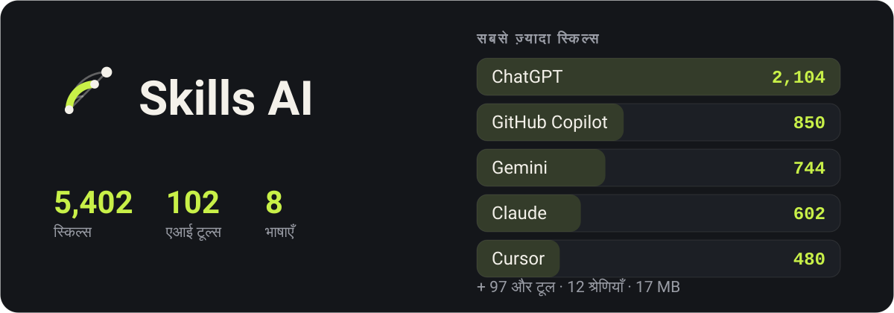

<p align="center">
  
</p>

<div align="center">

एआई टूल्स और उन्हें आपके काम में बेहतर बनाने वाली स्किल्स की डायरेक्टरी — ऑफ़लाइन, आठ भाषाओं में।

</div>

<div align="center">

[English](../README.md) · [فارسی](README.fa.md) · [العربية](README.ar.md) · [Türkçe](README.tr.md) · **हिन्दी** · [Español](README.es.md) · [Deutsch](README.de.md) · [Français](README.fr.md)

</div>

## यह कैसा दिखता है

<p align="center">
  
  
  
  
</p>

## डाउनलोड

### एंड्रॉइड

| फ़ाइल | किसके लिए |
|---|---|
| [`app-arm64-v8a-release.apk`](https://github.com/ehsanking/Skills-Ai/releases/latest/download/app-arm64-v8a-release.apk) | ज़्यादातर फ़ोन — लगभग पिछले आठ साल में बना कोई भी। **यहीं से शुरू करें।** |
| [`app-armeabi-v7a-release.apk`](https://github.com/ehsanking/Skills-Ai/releases/latest/download/app-armeabi-v7a-release.apk) | पुराने या एंट्री-लेवल फ़ोन, 32-बिट। |
| [`app-x86_64-release.apk`](https://github.com/ehsanking/Skills-Ai/releases/latest/download/app-x86_64-release.apk) | एमुलेटर, और गिने-चुने x86 टैबलेट। |

गलत चुनने पर Android कुछ टूटा हुआ इंस्टॉल करने के बजाय इंस्टॉल करने से मना कर देता है — इसलिए पहले `arm64-v8a` आज़माने में कुछ नहीं जाता।

**जो डाउनलोड किया उसकी जाँच**

यहाँ का हर APK एक ही की से साइन किया गया है, और कुछ भी इंस्टॉल करने से पहले आप इसे जाँच सकते हैं:

```
apksigner verify --print-certs app-arm64-v8a-release.apk
```

सर्टिफ़िकेट में `CN=Ehsan King, OU=Skills AI` और यही SHA-256 फ़िंगरप्रिंट दिखना चाहिए। जो बिल्ड यह न दिखाए वह यहाँ से नहीं आया।

```
DF:9A:3E:BD:B2:28:06:F4:0F:99:3F:64:0D:46:A2:D2:5A:EA:12:49:53:0F:FF:39:C6:75:C4:BB:4F:66:E1:B4
```

### विंडोज़

| फ़ाइल | किसके लिए |
|---|---|
| [`SkillsAI-1.0.0-windows-x64-setup.exe`](https://github.com/ehsanking/Skills-Ai/releases/latest/download/SkillsAI-1.0.0-windows-x64-setup.exe) — 23 MB | **इंस्टॉलर.** आपके अपने यूज़र फ़ोल्डर में इंस्टॉल होता है — कोई एडमिन अनुमति नहीं माँगता, आपके अकाउंट के बाहर कुछ नहीं लिखता। स्टार्ट मेन्यू में एंट्री और एक सही अनइंस्टॉलर जोड़ता है। |
| [`SkillsAI-1.0.0-windows-x64.zip`](https://github.com/ehsanking/Skills-Ai/releases/latest/download/SkillsAI-1.0.0-windows-x64.zip) — 26 MB | **पोर्टेबल ज़िप.** एक पोर्टेबल बिल्ड। कहीं भी अनज़िप करें और `SkillsAI.exe` चलाएँ — कुछ भी इंस्टॉल नहीं होता, रजिस्ट्री में कुछ नहीं लिखा जाता, और पहली बार खुलने पर कैटलॉग `%APPDATA%\Skills AI` में खुल जाता है। विंडोज़ 10 (1809) और उसके बाद, 64-बिट। हटाने के लिए फ़ोल्डर मिटा दें। |

<p align="center">
  
</p>

विंडोज़ कहेगा कि वह प्रकाशक को नहीं पहचानता। यह चेतावनी अपेक्षित है: यह बिल्ड किसी भुगतान वाले कोड-साइनिंग सर्टिफ़िकेट से साइन नहीं है। आपसे भरोसे पर आगे बढ़ने को कहने के बजाय, यह दोनों फ़ाइलों का SHA-256 है — जो आपने डाउनलोड की उससे मिलाकर देखें।

```
ab39330edf1630786a2c017af9fccf0ed5df8544cf505d90cd7f4f27d3b6a9e6  SkillsAI-1.0.0-windows-x64-setup.exe
d7a72df9b944f16d040d2652ac5c9c4c673a4189b064b22bded2fddae1c3740a  SkillsAI-1.0.0-windows-x64.zip
```

```
certutil -hashfile SkillsAI-1.0.0-windows-x64-setup.exe SHA256
```

## यह क्या है

हर एआई टूल तब बेहतर जवाब देता है जब आप उसे बताते हैं कि कैसे। एक प्रॉम्प्ट जो Claude को बार-बार माफ़ी माँगने से रोके, एक नियम जो Cursor को आपके कन्वेंशन के भीतर रखे, एक सिस्टम मैसेज जो Gemini से वैसी भाषा लिखवाए जो कोई देशी वक्ता सचमुच लिखता — ये मौजूद हैं, सैकड़ों रिपॉज़िटरी में बिखरे, और ज़रूरत के वक़्त सही वाला ढूँढना ही पूरी समस्या है।

Skills AI **102 टूल्स के लिए उनमें से 5,402** इकट्ठा करता है, 12 श्रेणियों में बाँटता है, और एक सर्च की दूरी पर रख देता है। पूरी डायरेक्टरी ऐप के अंदर है: ट्रेन में, सुरंग में, हवाई जहाज़ में — बिना सिग्नल और बिना अकाउंट के खुलती है।

## यह क्या करता है

- **बिना कनेक्शन के चलता है** — पूरी डायरेक्टरी — 5,402 स्किल, उनका पूरा पाठ और सर्च इंडेक्स — ऐप के भीतर 17 MB के SQLite डेटाबेस के रूप में आती है। उन्हें पढ़ने के लिए कुछ भी डाउनलोड नहीं होता।
- **ऐसी खोज जो आपकी लिखी भाषा समझे** — हर शीर्षक और पाठ पर पूर्ण-पाठ खोज, जिसमें फ़ारसी और अरबी एक साथ मोड़ी जाती हैं: अरबी ये से लिखी गई क्वेरी फ़ारसी ये वाला पाठ ढूँढ लेती है, और अंकों के तीनों सेट एक गिने जाते हैं।
- **कॉपी करें, दोबारा न लिखें** — हर स्किल अपना सटीक पाठ, अपने टूल के लिए इंस्टॉल प्रक्रिया, और हर हिस्से पर एक कॉपी बटन साथ रखती है।
- **क्या यह सचमुच काम आई?** — स्किल इस्तेमाल करने के बाद एक टैप बताता है कि वह काम आई, कुछ हद तक आई, या नहीं आई — उसी मॉडल के लिए जो आपने इस्तेमाल किया। स्किल्स की रैंकिंग इसी पर है और प्रति व्यक्ति गिनी जाती है, इसलिए ज़्यादा बार जवाब देने से कुछ नहीं बदलता।
- **स्कोरबोर्ड के बिना एक कम्युनिटी** — अपनी स्किल प्रकाशित करें, उन लोगों को फ़ॉलो करें जिनका काम बार-बार आपके काम आता है, और स्किल के पन्ने पर ही देखें कि उनमें से किसने उसे आज़माया। कोई सार्वजनिक फ़ॉलोअर रैंकिंग नहीं, और ग्राफ़ सूचीबद्ध करने वाला कोई एंडपॉइंट नहीं।
- **आठ भाषाएँ, जिनमें चार दाएँ-से-बाएँ** — अंग्रेज़ी, फ़ारसी, अरबी, तुर्की, हिन्दी, स्पेनिश, जर्मन और फ़्रेंच — इंटरफ़ेस, अंक, तारीख़ें और लेआउट की दिशा।

## यह ऑफ़लाइन कैसे रहता है

<p align="center">
  
</p>

- **डाउनलोड के भीतर** — `skills.db`, 17 MB SQLite: 5,402 स्किल्स, उनके टेक्स्ट संपीड़ित, उन सब पर एक फ़ुल-टेक्स्ट इंडेक्स, और 33 थर्ड-पार्टी लाइसेंस टेक्स्ट पूरे।
- **पहला लॉन्च** — पैकेज से एक बार निकाला जाता है और रीड-ओनली खुलता है। खोजें, पढ़ें, कॉपी करें — नेटवर्क नहीं, अकाउंट नहीं, साइन-अप नहीं।
- **जब कैटलॉग बढ़ता है** — सर्वर नया कॉर्पस प्रकाशित करता है। ऐप उसे डाउनलोड करता है, sha256 जाँचता है, और लाइव फ़ाइल के बगल में रखता है — उस पर नहीं — फिर अगले लॉन्च पर बदल देता है।

## यह कैसे बना है

| | |
|---|---|
| **Android** | 8.0 and newer |
| **Flutter** | 3.44 / Dart 3.12 |
| **Catalogue** | SQLite + FTS4, bodies deflated, 17 MB inside the APK |
| **Backend** | Laravel 13 + Filament 5, [ai.ehsanking.ir](https://ai.ehsanking.ir) |
| **Package** | `gfly.skillsai.app` |
| **Tools / skills** | 102 / 5,402 |

## निजता

डायरेक्टरी बिना अकाउंट और बिना नेटवर्क चलती है। कोई विज्ञापन पहचानकर्ता नहीं, कोई डिवाइस पहचानकर्ता नहीं, कोई एनालिटिक्स SDK नहीं। अकाउंट सिर्फ़ कम्युनिटी के लिए चाहिए — पोस्ट करने, अपनी स्किल प्रकाशित करने, या यह बताने के लिए कि कोई स्किल काम आई या नहीं — और तब भी ऐप आपके बारे में वह कुछ नहीं जुटाता जो आपने ख़ुद न लिखा हो। पूरा पाठ ऐप में Settings के नीचे और [वेबसाइट](https://ai.ehsanking.ir/pp) पर है।

## सहयोग

ऐप में सब कुछ मुफ़्त है — हर स्किल, कम्युनिटी, सर्च और ऑफ़लाइन कॉपी — कोई पेड टियर नहीं, कोई सब्सक्रिप्शन नहीं, और अकाउंट के पीछे कुछ भी छिपाया नहीं गया। इसे चलाए रखने वाली चीज़ें विज्ञापन और दान हैं, और दोनों एक ही जगह जाते हैं: सर्वर, स्टोरेज, बैंडविड्थ, और इसे बेहतर बनाने का काम।

**विज्ञापन दें** — ऐप में दो प्रायोजित स्लॉट हैं। विवरण [विज्ञापन और सहयोग पृष्ठ](https://ai.ehsanking.ir/advertise) पर।

**दान करें** — USDT, इन दो नेटवर्क में से किसी पर भी। BEP-20 भेजना आम तौर पर सस्ता पड़ता है:

**BEP-20 · BNB Smart Chain**

```
0x53F494E1Fc1Ee777C55B49048dd1ab7e4C5d7244
```

**TRC-20 · TRON**

```
TKPswLQqd2e73UTGJ5prxVXBVo7MTsWedU
```

> सिर्फ़ USDT, और सिर्फ़ इन्हीं दो नेटवर्क पर। कोई दूसरा कॉइन या दूसरा नेटवर्क वापस नहीं आता — वह बस खो जाता है।

## लाइसेंस

ऐप प्रोप्राइटरी है — [LICENSE](../LICENSE) देखें। यहाँ प्रकाशित बिल्ड आप स्वतंत्र रूप से इंस्टॉल और उपयोग कर सकते हैं; उन्हें दोबारा प्रकाशित या बेच नहीं सकते।

**डायरेक्टरी ऐसी नहीं है।** उसमें हर स्किल उसके लेखक की है और उसी लाइसेंस के तहत साझा होती है जो उसने चुना — CC0-1.0, MIT, Apache-2.0 या CC-BY-4.0। सभी 33 स्रोत [THIRD-PARTY-NOTICES.md](../THIRD-PARTY-NOTICES.md) में नामित हैं, और वही नोटिस ऐप के भीतर भी भेजे जाते हैं। बिना लाइसेंस वाली स्किल शामिल नहीं की गई, क्योंकि लाइसेंस न होना यानी अनुमति न होना।

## लेखक

**Ehsan King** — [github.com/ehsanking](https://github.com/ehsanking)
