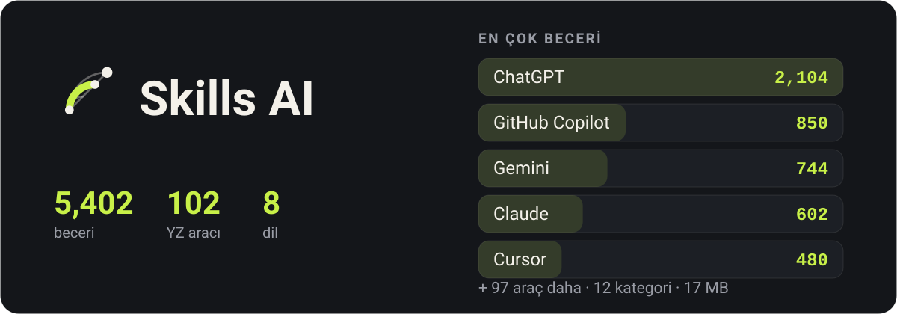

<p align="center">
  
</p>

<div align="center">

Yapay zeka araçlarının ve onları işinizde daha iyi yapan becerilerin rehberi — çevrimdışı, sekiz dilde.

</div>

<div align="center">

[English](../README.md) · [فارسی](README.fa.md) · [العربية](README.ar.md) · **Türkçe** · [हिन्दी](README.hi.md) · [Español](README.es.md) · [Deutsch](README.de.md) · [Français](README.fr.md)

</div>

## Nasıl göründüğü

<p align="center">
  
  
  
  
</p>

## İndir

### Android

| Dosya | Şunun için |
|---|---|
| [`app-arm64-v8a-release.apk`](https://github.com/ehsanking/Skills-Ai/releases/latest/download/app-arm64-v8a-release.apk) | Çoğu telefon — kabaca son sekiz yılda yapılmış her şey. **Buradan başlayın.** |
| [`app-armeabi-v7a-release.apk`](https://github.com/ehsanking/Skills-Ai/releases/latest/download/app-armeabi-v7a-release.apk) | Daha eski ya da giriş seviyesi telefonlar, 32 bit. |
| [`app-x86_64-release.apk`](https://github.com/ehsanking/Skills-Ai/releases/latest/download/app-x86_64-release.apk) | Emülatörler ve birkaç x86 tablet. |

Yanlışını seçerseniz Android bozuk bir şey kurmak yerine kurulumu reddeder — yani önce `arm64-v8a` denemenin bir maliyeti yok.

**İndirdiğinizi doğrulamak**

Buradaki her APK aynı anahtarla imzalıdır ve bir şey kurmadan önce bunu doğrulayabilirsiniz:

```
apksigner verify --print-certs app-arm64-v8a-release.apk
```

Sertifikada `CN=Ehsan King, OU=Skills AI` ve şu SHA-256 parmak izi görünmeli. Bunu göstermeyen bir yapı buradan gelmemiştir.

```
DF:9A:3E:BD:B2:28:06:F4:0F:99:3F:64:0D:46:A2:D2:5A:EA:12:49:53:0F:FF:39:C6:75:C4:BB:4F:66:E1:B4
```

### Windows

[`SkillsAI-1.0.0-windows-x64.zip`](https://github.com/ehsanking/Skills-Ai/releases/latest/download/SkillsAI-1.0.0-windows-x64.zip) — 26 MB

Taşınabilir bir yapı. Nereye isterseniz açın ve `SkillsAI.exe` dosyasını çalıştırın — hiçbir şey kurulmaz, kayıt defterine bir şey yazılmaz ve katalog ilk açılışta `%APPDATA%\Skills AI` içine çıkarılır. Windows 10 (1809) ve üzeri, 64 bit. Kaldırmak için klasörü silin.

<p align="center">
  
</p>

Windows yayıncıyı tanımadığını söyleyecek. Bu uyarı beklenen bir şey: yapı ücretli bir kod imzalama sertifikasıyla imzalanmadı. Sırf bana güvenip geçmenizi istemek yerine, zip dosyasının SHA-256 değeri burada — indirdiğiniz dosyayla karşılaştırın.

```
d7a72df9b944f16d040d2652ac5c9c4c673a4189b064b22bded2fddae1c3740a
```

```
certutil -hashfile SkillsAI-1.0.0-windows-x64.zip SHA256
```

## Nedir

Her yapay zeka aracı, nasıl yapacağını söylediğinizde daha iyi yanıt verir. Claude'un sürekli özür dilemesini kesen bir istem, Cursor'u kendi kurallarınızın içinde tutan bir kural, Gemini'ye anadili konuşanın gerçekten yazacağı metni yazdıran bir sistem mesajı — bunlar var, yüzlerce depoya dağılmış hâlde, ve ihtiyaç anında doğrusunu bulmak işin tamamı.

Skills AI bunlardan **102 araç için 5,402 tanesini** topluyor, 12 kategoriye ayırıyor ve bir aramalık mesafeye koyuyor. Katalogun tamamı uygulamanın içinde: trende, tünelde, uçakta, sinyalsiz ve hesapsız açılır.

## Ne yapar

- **Bağlantı olmadan çalışır** — Katalogun tamamı — 5,402 beceri, tam metinleri ve arama dizini — uygulamanın içinde 17 MB’lık bir SQLite veritabanı olarak gelir. Okumak için hiçbir şey indirilmez.
- **Yazdığınız dili anlayan arama** — Her başlık ve metin üzerinde tam metin arama; Farsça ve Arapça birlikte katlanır: Arapça ye ile yazılan bir sorgu, Farsça ye ile yazılmış metni bulur ve üç rakam kümesi tek sayılır.
- **Kopyalayın, yeniden yazmayın** — Her beceri kendi tam metnini, ait olduğu araç için kurulum yordamını ve her parçada bir kopyalama düğmesini taşır.
- **Gerçekten işe yaradı mı?** — Bir beceriyi kullandıktan sonraki tek dokunuş, kullandığınız model için işe yaradı mı, kısmen mi, yoksa yaramadı mı söyler. Beceriler buna göre sıralanır ve kişi başına sayılır; daha sık yanıtlamak hiçbir şeyi değiştirmez.
- **Skor tablosu olmayan bir topluluk** — Kendi becerilerinizi yayımlayın, işi size sürekli yarayan kişileri takip edin ve becerinin kendi sayfasında hangilerinin denediğini görün. Herkese açık takipçi sıralaması yok, grafiği listeleyen bir uç nokta da yok.
- **Sekiz dil, dördü sağdan sola** — İngilizce, Farsça, Arapça, Türkçe, Hintçe, İspanyolca, Almanca ve Fransızca — arayüz, rakamlar, tarihler ve yerleşim yönü.

## Çevrimdışı nasıl kalıyor

<p align="center">
  
</p>

- **İndirilenin içinde** — `skills.db`, 17 MB SQLite: gövdeleri sıkıştırılmış 5,402 beceri, hepsinin üzerinde tam metin dizini ve 33 üçüncü taraf lisans metni tam olarak.
- **İlk açılış** — Paketten bir kez çıkarılır ve salt okunur açılır. Ara, oku, kopyala — ağ yok, hesap yok, kayıt yok.
- **Katalog büyüdüğünde** — Sunucu yeni bir derlem yayımlar. Uygulama indirir, sha256 değerini doğrular ve canlı dosyanın yanına koyar — üzerine değil — sonra bir sonraki açılışta değiştirir.

## Nasıl yapıldı

| | |
|---|---|
| **Android** | 8.0 and newer |
| **Flutter** | 3.44 / Dart 3.12 |
| **Catalogue** | SQLite + FTS4, bodies deflated, 17 MB inside the APK |
| **Backend** | Laravel 13 + Filament 5, [ai.ehsanking.ir](https://ai.ehsanking.ir) |
| **Package** | `gfly.skillsai.app` |
| **Tools / skills** | 102 / 5,402 |

## Gizlilik

Katalog hesapsız ve ağsız çalışır. Reklam kimliği yok, cihaz kimliği yok, analitik SDK yok. Hesap yalnızca topluluk için gerekir — paylaşmak, kendi becerinizi yayımlamak veya bir becerinin işe yarayıp yaramadığını söylemek için — ve o zaman bile uygulama sizin yazmadığınız hiçbir şeyi toplamaz. Tam metin uygulamada Ayarlar altında ve [web sitesinde](https://ai.ehsanking.ir/pp).

## Destek

Uygulamadaki her şey ücretsiz — her beceri, topluluk, arama ve çevrimdışı kopya — ücretli bir katman, abonelik ya da hesap ardına saklanmış bir şey yok. Onu ayakta tutan reklam ve bağışlar; ikisi de aynı yere gidiyor: sunucular, depolama, bant genişliği ve daha iyisini yapma emeği.

**Reklam verin** — uygulamada iki sponsorlu alan var. Ayrıntılar [Reklam ve Destek sayfasında](https://ai.ehsanking.ir/advertise).

**Bağış** — TRON ağında USDT (TRC-20):

```
TKPswLQqd2e73UTGJ5prxVXBVo7MTsWedU
```

> USDT · TRC-20 (TRON). Sending any other coin or using any other network will lose it.

## Lisans

Uygulama tescillidir — bkz. [LICENSE](../LICENSE). Burada yayımlanan sürümleri serbestçe kurup kullanabilirsiniz; yeniden yayımlayamaz veya satamazsınız.

**Katalog öyle değil.** İçindeki her beceri onu yazana aittir ve onun seçtiği lisansla dağıtılır — CC0-1.0, MIT, Apache-2.0 veya CC-BY-4.0. 33 kaynağın tamamı [THIRD-PARTY-NOTICES.md](../THIRD-PARTY-NOTICES.md) içinde adlandırılmıştır ve aynı bildirimler uygulamayla birlikte gelir. Hiçbir lisansı olmayan beceri dahil edilmedi, çünkü lisans yoksa izin de yoktur.

## Geliştirici

**Ehsan King** — [github.com/ehsanking](https://github.com/ehsanking)
